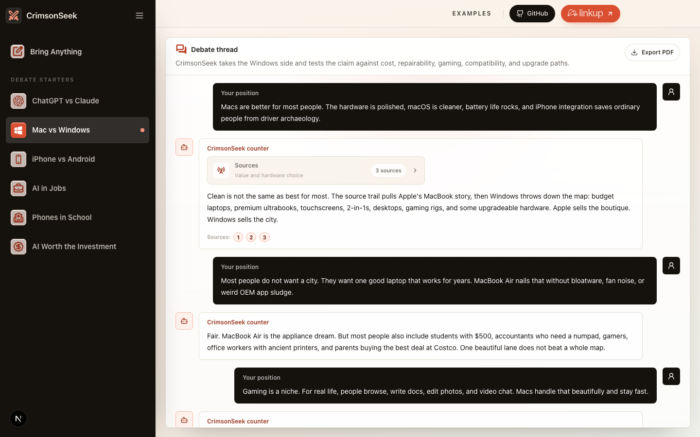

# CrimsonSeek

CrimsonSeek is an evidence-backed debate opponent. Bring any claim, take a side, and CrimsonSeek argues the strongest fair countercase with credible sources attached.

It works using a Gemini-powered opponent that reads your position, chooses the opposing side, searches for evidence via the Linkup Search API when receipts matter, and keeps the source trail visible.

## Demo




The project includes example debate audits that show CrimsonSeek in action with saved countercases and source panels.

## Product

- **Debate-first flow:** Pick a starter or bring anything, then argue with CrimsonSeek in a thread.
- **AI stack:** Gemini 3.1 Flash Lite handles the debate logic because Google AI Studio's free tier has generous rate limits.
- **Fast evidence retrieval:** CrimsonSeek uses the Linkup Search API with `depth: "fast"` for quick, low-latency source checks.
- **Credible-source posture:** The retrieval prompt and source-quality filter prefer primary sources, institutional reports, reputable reporting, benchmarks, documentation, and expert analysis over SEO spam or thin summaries.
- **Inspectable sources:** A response can show `Sources: 1 2 3`; selecting one opens the source panel for that exact piece of evidence.
- **Exportable threads:** Debates can be exported as a PDF for review or sharing.

## Linkup

CrimsonSeek uses [Linkup Search](https://docs.linkup.so/pages/documentation/endpoints/search/reference) for live web grounding. The app requests sourced answers from `/v1/search`, asks for inline citations, and keeps the search depth on `fast` for quick, responsive debate latency. Query guidance and domain filtering push results toward high-quality, evidence-bearing sources.

## How to run it locally

Install dependencies:

```bash
npm install
```

Create `.env` or `.env.local`, and insert your gemini and linkup api keys:

```env
LINKUP_API_KEY=your_linkup_key_here
GEMINI_API_KEY=your_gemini_key_here
GEMINI_MODEL=gemini-3.1-flash-lite
```

Start the app:

```bash
npm run dev
```

Open [http://localhost:3000](http://localhost:3000).

## Scripts

- `npm run dev` starts the local development server.
- `npm run build` creates a production build.
- `npm start` serves the production build.
- `npm run typecheck` checks TypeScript.

## Stack

Next.js 15, React 19, TypeScript, Tailwind CSS v4, Linkup Search API, Gemini 3.1 Flash Lite, and jsPDF.
